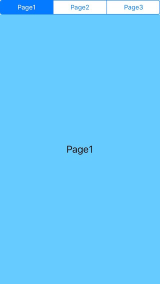
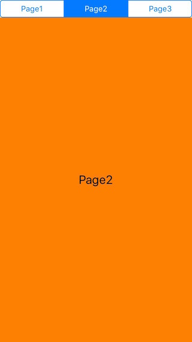
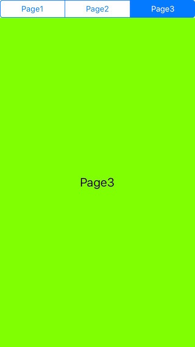

# ContanerView

 
 

Screenshot
------------

 
 

Reference
------------

[Switching Child View Controllers in iOS with Auto Layout](https://spin.atomicobject.com/2015/10/13/switching-child-view-controllers-ios-auto-layout/)

